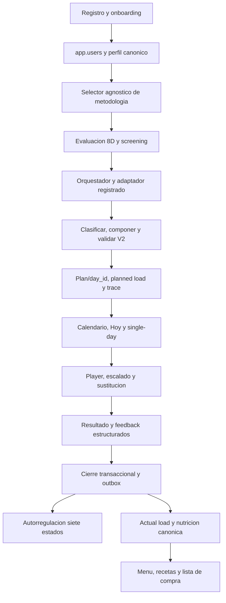

# Auditoria CrossFit: baseline, implementacion y divergencias

## Reauditoría de implementación 2026-07-22

Transacción `READ ONLY` + `ROLLBACK` contra Supabase: 120 filas en
`app."Ejercicios_CrossFit"`, 19 Elite, 0 CrossFit en `app.ejercicios`, 120/120
sin `Consejos` y 120/120 sin `Errores_comunes`. RLS está desactivado y no hay
políticas en `Ejercicios_CrossFit`, `ejercicios` ni `crossfit_autoreg_state`.
Se confirmaron 29 calendarios y 1.414 `methodology_exercise_sessions` históricas
sin `day_id`; se conservan mediante fallback y no se backfillean en producción.

La migración aditiva `20260722_crossfit_v2_catalog.sql` queda preparada y no
aplicada. Crea catálogo versionado separado y RLS de lectura de versión activa;
no altera las tablas legacy ni las de sesiones. El delta de implementación se
encuentra en `codex/crossfit-profesional-v2`, sincronizado con
`origin/main@3e09559`, y permanece aislado, sin push ni activación productiva.

Fecha de corte: 2026-07-22. Fuentes de verdad: codigo de la copia local, `origin/main` leido sin cambiar de rama y proyecto Supabase `sbqcnlwpvjavmljzkmfy` consultado en transaccion `READ ONLY`.

## Alcance y cautelas

- No se reiniciaron servicios.
- No se escribio en BD ni se crearon usuarios.
- No se aplicaron migraciones, flags ni rulesets.
- La auditoría inicial se hizo sin alterar el checkout documental. La implementación posterior usa un worktree limpio separado y conserva ese baseline como evidencia histórica.
- Una ruta existente se clasifica como cubierta solo si contrato, persistencia, seguridad y QA cierran juntos.

## Flujo V2 implementado bajo flags apagados

Con `CROSSFIT_V2_GENERATION`, `CROSSFIT_V2_RESULTS`,
`CROSSFIT_EMITS_TRAINING_LOAD` y `CROSSFIT_NUTRITION_LOAD` en `false`, el
comportamiento productivo permanece legacy. La ruta V2 solo puede considerarse
operativa en QA después de aplicar las migraciones preparadas en PostgreSQL
aislado y ejecutar RLS/E2E.

## Inventario funcional

| Pieza               | Estado                    | Evidencia                                      | Brecha o riesgo                                             |
| ------------------- | ------------------------- | ---------------------------------------------- | ----------------------------------------------------------- |
| Registro/login      | Funciona                  | `backend/routes/auth.js`                       | No captura screening estructurado                           |
| Perfil canonico     | Parcial                   | `userRepository.js`, `userProfileContract.js`  | Duplicidad `users`/`user_profiles`; solo lesiones textuales |
| Selector            | Funciona                  | componentes de Methodologie                    | Debe conservarse agnostico                                  |
| Evaluacion CrossFit | Implementada con gate BD  | evaluación 8D, servicio y ledger preparado     | migración/RLS/E2E y revisión humana pendientes              |
| Plan completo       | Implementado bajo flag    | builder 8/10/12, composer y validador          | activación y E2E pendientes                                 |
| Single-day          | Implementado bajo flag    | adaptador determinista y persistencia          | E2E con PostgreSQL aislado pendiente                        |
| Calendario/Hoy      | Integrado bajo flag       | `plan_id+day_id`, revisión y fallback          | deuda histórica se conserva; E2E pendiente                  |
| Player WOD          | Implementado V2           | runtime, draft durable y feedback              | accesibilidad/offline real pendientes                       |
| Sustitucion         | Implementada V2           | safety evaluator y preservación de stimulus    | validación humana de mappings                               |
| Cierre/abandono     | Implementado con gate BD  | resultado, autorreg, actual load y outbox      | migración, RLS y reintentos E2E pendientes                  |
| Autorregulacion     | Implementada V2           | reducer de siete estados y snapshot            | migración/RLS/E2E pendientes                                |
| Nutricion           | Implementada flag off     | D0/D1/D2, presentación active y compras V2     | migración, shadow, métricas y dietista pendientes           |
| Historial/metricas  | Implementado con gate BD  | resultado versionado y métricas sin PII        | compatibilidad real y dashboard QA pendientes               |
| Offline/reintento   | Implementado parcialmente | draft local, revisión inmutable e idempotencia | E2E offline/reload/dispositivo pendiente                    |
| Observabilidad      | Implementada técnicamente | reason codes y muestras planned/actual         | ejecución sobre datos QA pendiente                          |
| RLS                 | Preparado, no aplicado    | seis migraciones y suites cross-user de CI     | riesgo alto hasta ejecución/autorización                    |

## Perfil real reutilizable

Campos disponibles y utiles: edad, sexo declarado, peso, altura, objetivo, actividad, anos entrenando, nivel general, frecuencia, dias y horario preferidos, limitaciones/lesiones textuales, historial medico textual, alergias, medicacion, alimentos excluidos y equipamiento en tablas propias.

Campos que faltan para el modelo profesional:

- dolor actual: localizacion, intensidad 0-10, inicio, comportamiento y cambio durante esfuerzo;
- lesion diagnosticada y estado de retorno, sin guardar un diagnostico inferido;
- red flags estructuradas y autorizacion profesional;
- embarazo, trimestre, posparto y autorizacion obstetrica;
- enfermedad cardiovascular/metabolica/renal conocida y sintomas de esfuerzo;
- sueno, fatiga, estres y recuperacion con timestamp;
- capacidades por patron, permisos de skill y confianza de evaluacion;
- historial de carga por dominio y resultado comparable.

Decision: `app.users.limitaciones_fisicas` sigue siendo canonico para compatibilidad. La rama V2 añade contratos y entidades versionadas de evaluación, resultado y runtime; no copia esos datos en una tercera cadena textual. El screening clínico completo continúa bloqueado hasta contrato y validación profesional.

## Contrato de Fase 0 comprobado en origin/main

`training-load/v1` contiene metodologia/nivel, tipo y estado de sesion, `D0/D1/D2`, tier de carga, duracion, RPE, trabajo, demandas, recuperacion, entorno, contexto y procedencia. La identidad canonica de dia es `plan_id + day_id`; el cierre emite `training.session_completed` en outbox. La migración `20260721_backfill_mes_day_id.sql` está registrada en Supabase con checksum coincidente. Las 29 filas de calendario y 1.414 sesiones históricas sin `day_id` son deuda compatible con fallback y no se reescriben.

La rama V2 ya produce planned load al generar y actual load al cerrar sin derivar reps, tiempo o escala de texto libre. `CROSSFIT_EMITS_TRAINING_LOAD` y nutrición permanecen apagados hasta superar PostgreSQL/RLS, shadow, métricas y aprobación.

## Base de datos real

### Catalogo

- 120 filas, sin duplicados exactos de nombre.
- 30 principiante, 42 intermedio, 29 avanzado y 19 Elite.
- 41 Gymnastic, 42 Weightlifting, 21 Monostructural y 16 Accessories.
- `Cómo_hacerlo`: 120/120 poblado.
- `Consejos`: 0/120 poblado.
- `Errores_comunes`: 0/120 poblado.
- `is_benchmark`: 0/120 activo. Es correcto que un movimiento no sea un benchmark, pero el campo y el generador mezclan conceptos.
- `rx_carga_sugerida`: 37/120 poblado; varias dosis estan embebidas en el nombre.
- `gif_url`: 23 vacios; parte de los restantes son rutas raw o recursos sin verificacion editorial.

La afirmacion documental previa de que `Cómo_hacerlo` estaba vacio era falsa; se corrige aqui. El registro historico que hablaba de 21 benchmarks no coincide con la BD consultada en esta fecha. La BD manda.

### RLS y privacidad

La consulta live mostro `relrowsecurity=false` y cero policies en `users`, `user_profiles`, `Ejercicios_CrossFit`, `crossfit_autoreg_state`, `methodology_plans` y `methodology_plan_days`. Esto no prueba una exposicion publica, porque el backend puede aislar acceso, pero impide considerar defensa en profundidad cerrada. `REQUIERE_MIGRACION_AUTORIZADA` y pruebas de aislamiento por usuario.

## Deuda y codigo desconectado

- Elite existe en catalogo y descriptor, pero queda fuera del producto principal.
- `crossfit_autoreg_state` existe; no demuestra que todas las sesiones historicas pasen por autorregulacion.
- Producción aún ejecuta el camino legacy porque los flags V2 siguen apagados.
- Las migraciones V2 y sus políticas RLS están preparadas, pero no ejecutadas ni verificadas contra PostgreSQL local.
- La regex legacy de lesiones solo actúa como fallback conservador; el safety evaluator V2 no puede autorizar a partir de texto ambiguo.
- La generación V2 supera el gate puro de 30.000 planes, pero no equivale a validar persistencia, UI ni eficacia deportiva real.

## Riesgos priorizados

| Prioridad | Riesgo                    | Impacto                           | Resolucion exacta                                              |
| --------- | ------------------------- | --------------------------------- | -------------------------------------------------------------- |
| P0        | Seguridad no estructurada | Prescripcion incompatible         | screening, stop rules, permisos por skill, bloqueo conservador |
| P0        | RLS desactivado           | Privacidad/aislamiento            | policies + tests con roles y usuarios cruzados                 |
| P0        | Rollout sin shadow        | Desajuste entrenamiento-nutricion | mantener flags off hasta BD, métricas y aprobación             |
| P1        | QA de persistencia/E2E    | Defectos no observados            | ejecutar CI PostgreSQL, RLS, Playwright y offline              |
| P1        | Catalogo no activado      | Fallback legacy en producción     | migración autorizada, dry-run, revisión y activación separada  |
| P1        | Nombre CrossFit           | Riesgo de marca                   | denominacion neutral y revision legal                          |
| P2        | Media no verificada       | Mala ejecucion                    | workflow editorial; nunca inventar URL                         |

## Veredicto

La implementación técnica V2 cubre clasificación, programación, composer, seguridad, runtime, resultados, autorregulación, training load y nutrición bajo flags apagados. No está lista para producción: faltan ejecutar migraciones/RLS y E2E en infraestructura aislada, completar shadow y obtener validaciones deportiva, nutricional, clínica y legal. El flujo legacy productivo permanece sin cambios mientras esos gates sigan cerrados.
