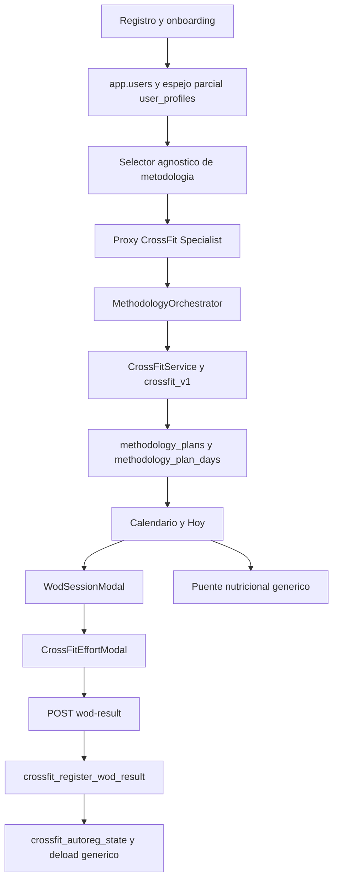

# Auditoria CrossFit: estado real y divergencias

## Reauditoría de implementación 2026-07-22

Transacción `READ ONLY` + `ROLLBACK` contra Supabase: 120 filas en
`app."Ejercicios_CrossFit"`, 19 Elite, 0 CrossFit en `app.ejercicios`, 120/120
sin `Consejos` y 120/120 sin `Errores_comunes`. RLS está desactivado y no hay
políticas en `Ejercicios_CrossFit`, `ejercicios` ni `crossfit_autoreg_state`.
Se confirmaron 29 calendarios y 1.414 `methodology_exercise_sessions` históricas
sin `day_id`; se conservan mediante fallback y no se backfillean en producción.

La migración aditiva `20260722_crossfit_v2_catalog.sql` queda preparada y no
aplicada. Crea catálogo versionado separado y RLS de lectura de versión activa;
no altera las tablas legacy ni las de sesiones.

Fecha de corte: 2026-07-22. Fuentes de verdad: codigo de la copia local, `origin/main` leido sin cambiar de rama y proyecto Supabase `sbqcnlwpvjavmljzkmfy` consultado en transaccion `READ ONLY`.

## Alcance y cautelas

- No se reiniciaron servicios.
- No se escribio en BD ni se crearon usuarios.
- No se aplicaron migraciones, flags ni rulesets.
- El checkout local esta por detras de `origin/main` y contiene cambios ajenos; por eso los contratos de Fase 0 se inspeccionaron con `git show origin/main:...`.
- Una ruta existente se clasifica como cubierta solo si contrato, persistencia, seguridad y QA cierran juntos.

## Flujo actual comprobado

## Inventario funcional

| Pieza               | Estado                     | Evidencia                                     | Brecha o riesgo                                               |
| ------------------- | -------------------------- | --------------------------------------------- | ------------------------------------------------------------- |
| Registro/login      | Funciona                   | `backend/routes/auth.js`                      | No captura screening estructurado                             |
| Perfil canonico     | Parcial                    | `userRepository.js`, `userProfileContract.js` | Duplicidad `users`/`user_profiles`; solo lesiones textuales   |
| Selector            | Funciona                   | componentes de Methodologie                   | Debe conservarse agnostico                                    |
| Evaluacion CrossFit | Parcial                    | prompt en `CrossFitService.js`                | IA decide demasiado; no hay matriz objetiva persistida        |
| Plan completo       | Funciona con modelo legacy | orquestador y `CrossFitService`               | Cuotas genericas y Elite mezclado                             |
| Single-day          | Funciona con modelo legacy | `singleDay/crossfitSingleDay.js`              | Seleccion aleatoria, validacion incompleta                    |
| Calendario/Hoy      | Funciona parcialmente      | plan days y Today tab                         | Fase 0 esta consolidando `day_id`                             |
| Player WOD          | Funciona                   | `WodSessionModal.jsx`                         | Resultado no cubre todas las metricas nuevas                  |
| Sustitucion         | Parcial                    | filtros y UI compartidos                      | No preserva siempre stimulus ni explica razon                 |
| Cierre/abandono     | Parcial                    | rutas de training session y WOD result        | Dos cierres a reconciliar; outbox de Fase 0 pendiente de gate |
| Autorregulacion     | Simulada/simplificada      | `planAutoregService.js` y SQL                 | Regla de faciles/duros no modela tecnica, dolor o tendencias  |
| Nutricion           | Parcial                    | `carbTiming.js`, bridge generico              | CrossFit `emits_training_load:false` en `origin/main`         |
| Historial/metricas  | Parcial                    | sesiones y progreso                           | No existe resultado WOD canonico versionado                   |
| Offline/reintento   | Parcial                    | runtime v2 + revisión inmutable preparada     | Cierre/feedback durable y E2E efímero aún pendientes          |
| Observabilidad      | Parcial                    | metricas Fase 0                               | Sin reason codes CrossFit ni PII policy especifica            |
| RLS                 | Riesgo alto                | consulta live                                 | Desactivado en tablas revisadas                               |

## Perfil real reutilizable

Campos disponibles y utiles: edad, sexo declarado, peso, altura, objetivo, actividad, anos entrenando, nivel general, frecuencia, dias y horario preferidos, limitaciones/lesiones textuales, historial medico textual, alergias, medicacion, alimentos excluidos y equipamiento en tablas propias.

Campos que faltan para el modelo profesional:

- dolor actual: localizacion, intensidad 0-10, inicio, comportamiento y cambio durante esfuerzo;
- lesion diagnosticada y estado de retorno, sin guardar un diagnostico inferido;
- red flags estructuradas y autorizacion profesional;
- embarazo, trimestre, posparto y autorizacion obstetrica;
- enfermedad cardiovascular/metabolica/renal conocida y sintomas de esfuerzo;
- sueno, fatiga, estres y recuperacion con timestamp;
- capacidades por patron, permisos de skill y confianza de evaluacion;
- historial de carga por dominio y resultado comparable.

Decision: `app.users.limitaciones_fisicas` sigue siendo canonico para compatibilidad. La rama futura añadira entidades especificas versionadas; no copiara esos datos en una tercera cadena textual.

## Contrato de Fase 0 comprobado en origin/main

`training-load/v1` contiene metodologia/nivel, tipo y estado de sesion, `D0/D1/D2`, tier de carga, duracion, RPE, trabajo, demandas, recuperacion, entorno, contexto y procedencia. La identidad canonica de dia es `plan_id + day_id`; el cierre emite `training.session_completed` en outbox. CrossFit permanece con `emits_training_load:false` y el backfill de `day_id` esta documentado como no aplicado.

Consecuencia: todo plan CrossFit futuro debe producir planned load, y el cierre debe producir actual load sin derivar reps, tiempo o escala de texto libre. Activar el descriptor antes del gate violaria el contrato.

## Base de datos real

### Catalogo

- 120 filas, sin duplicados exactos de nombre.
- 30 principiante, 42 intermedio, 29 avanzado y 19 Elite.
- 41 Gymnastic, 42 Weightlifting, 21 Monostructural y 16 Accessories.
- `Cómo_hacerlo`: 120/120 poblado.
- `Consejos`: 0/120 poblado.
- `Errores_comunes`: 0/120 poblado.
- `is_benchmark`: 0/120 activo. Es correcto que un movimiento no sea un benchmark, pero el campo y el generador mezclan conceptos.
- `rx_carga_sugerida`: 37/120 poblado; varias dosis estan embebidas en el nombre.
- `gif_url`: 23 vacios; parte de los restantes son rutas raw o recursos sin verificacion editorial.

La afirmacion documental previa de que `Cómo_hacerlo` estaba vacio era falsa; se corrige aqui. El registro historico que hablaba de 21 benchmarks no coincide con la BD consultada en esta fecha. La BD manda.

### RLS y privacidad

La consulta live mostro `relrowsecurity=false` y cero policies en `users`, `user_profiles`, `Ejercicios_CrossFit`, `crossfit_autoreg_state`, `methodology_plans` y `methodology_plan_days`. Esto no prueba una exposicion publica, porque el backend puede aislar acceso, pero impide considerar defensa en profundidad cerrada. `REQUIERE_MIGRACION_AUTORIZADA` y pruebas de aislamiento por usuario.

## Deuda y codigo desconectado

- Elite existe en catalogo y descriptor, pero queda fuera del producto principal.
- `crossfit_autoreg_state` existe; no demuestra que todas las sesiones historicas pasen por autorregulacion.
- La nutricion reconoce CrossFit por nombre, pero aun no recibe una carga canonica emitida por CrossFit.
- Los filtros por zona lesionada son regex conservadoras y pueden bloquear en exceso o permitir una variante inadecuada.
- La generacion actual puede crear planes reales; eso no equivale a cumplir las invariantes de esta especificacion.

## Riesgos priorizados

| Prioridad | Riesgo                    | Impacto                           | Resolucion exacta                                              |
| --------- | ------------------------- | --------------------------------- | -------------------------------------------------------------- |
| P0        | Seguridad no estructurada | Prescripcion incompatible         | screening, stop rules, permisos por skill, bloqueo conservador |
| P0        | RLS desactivado           | Privacidad/aislamiento            | policies + tests con roles y usuarios cruzados                 |
| P0        | Fase 0 no cerrada         | Desajuste entrenamiento-nutricion | mantener descriptor off hasta gate                             |
| P1        | Generador no reproducible | Planes no auditables              | seed, ruleset, decision trace e invariantes                    |
| P1        | Catalogo no canonico      | Variantes/dosis incoherentes      | modelo normalizado y backfill idempotente                      |
| P1        | Nombre CrossFit           | Riesgo de marca                   | denominacion neutral y revision legal                          |
| P2        | Media no verificada       | Mala ejecucion                    | workflow editorial; nunca inventar URL                         |

## Veredicto

El flujo legacy es demostrable y parcialmente funcional. No esta listo para validacion profesional porque carece de clasificacion objetiva, seguridad estructurada, contrato de resultado, reglas exhaustivas y QA del nuevo modelo. La documentacion de este expediente cubre el diseño; implementacion y validacion siguen pendientes.
