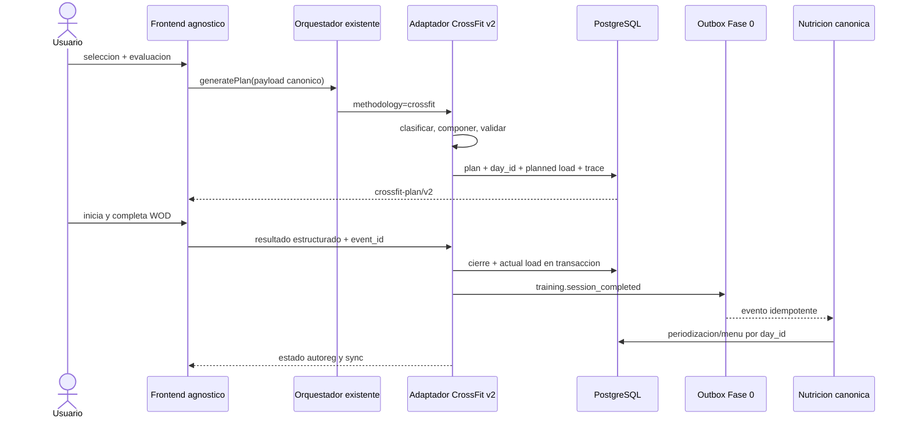

# Arquitectura, contratos e integracion

Objetivo: incorporar `crossfit-plan/v2` mediante adaptadores de metodologia, sin tocar el frontend agnostico, el redireccionador ni `WorkoutContext.generatePlan()`.

## Componentes v2 y estado

| Componente                    | Estado en rama                      | Prohibicion                  |
| ----------------------------- | ----------------------------------- | ---------------------------- |
| CrossFitClassificationService | implementado y testeado             | no usar IA como juez final   |
| CrossFitAssessmentLedger      | SQL/RLS preparado; no aplicado      | no confiar en autoafirmacion |
| CrossFitCatalogRepository     | implementado; migración no aplicada | no leer filas Elite core     |
| CrossFitProgramBuilder        | implementado 8/10/12 semanas        | no persistir directamente    |
| CrossFitWodComposer           | implementado; gate 30.000 verde     | no relajar hard filters      |
| CrossFitPlanValidator         | 44 invariantes implementadas        | no autocorregir sin trace    |
| CrossFitAutoregReducer        | implementado; SQL no aplicado       | no mutar historia            |
| CrossFitTrainingLoadAdapter   | planned/actual implementado         | flag emisión sigue apagado   |
| CrossFitNutritionMapper       | contrato/matriz; Fase I en curso    | no calcular menu paralelo    |
| CrossFitDecisionTrace         | incluido en contratos/snapshots     | no guardar prompts sensibles |

La integración de producto usa `productPlanService`, `scheduleMaterializer`,
`singleDayService` y `sessionPlanMetadataService`. Son adaptadores registrados;
no modifican la convergencia de `WorkoutContext.generatePlan()` ni introducen
condiciones CrossFit dispersas en el frontend agnóstico.

## Contratos API propuestos

| Operacion           | Request esencial                                            | Response                                  | Idempotencia                   |
| ------------------- | ----------------------------------------------------------- | ----------------------------------------- | ------------------------------ |
| capacidades         | user auth                                                   | flags, dimensiones, niveles/frecuencias   | read only                      |
| evaluar             | `crossfit-assessment/v2` + `request_id` + screening         | classification, safety, confidence, trace | `user+request_id+content_hash` |
| revisar evidencia   | admin fail-closed + assessment + reviewer reference         | verified/revoked event                    | `user+idempotency_key`         |
| generar plan        | start, frequency, time, equipment snapshot, `assessment_id` | `crossfit-plan/v2`                        | plan idempotency key           |
| single-day          | date/day_id, time, equipment, readiness                     | session v2                                | user+date+purpose+revision     |
| regenerar           | plan/day, reason, expected revision                         | new revision + diff                       | request key                    |
| sustituir           | session, movement, symptom/equipment reason                 | validated scale/substitution              | session+movement+revision      |
| iniciar             | plan_id+day_id+session revision                             | start event                               | unique active start            |
| pausar/reanudar     | session instance + monotonic sequence                       | timer state                               | sequence/event id              |
| finalizar/abandonar | structured result + feedback                                | actual load + autoreg pending/applied     | completion event id            |
| estado              | plan/day                                                    | session, sync, nutrition, autoreg status  | read only                      |

Todos responden `schema_version`, `ruleset_version`, `catalog_version`, `request_id` y errores con `reason_code`, `retryable`, `safe_fallback`.

## Persistencia

- Plan/sesion: tablas de metodologia existentes con JSON v2 o nuevas tablas normalizadas segun diseño de rama.
- Identidad: `plan_id + day_id`; date es atributo, no clave primaria de enlace.
- Resultado: entidad append-only con version y event id.
- Evaluacion: `crossfit_v2_assessments` append-only; owner-read, escritura
  backend, secuencia monotona y hash de idempotencia. La autoevaluacion nunca
  guarda `technique_verified=true`; solo el ultimo evento profesional
  `verified` puede habilitar confianza alta y uno `revoked` la invalida.
- Autoreg: reducer por eventos y snapshot derivado.
- Training load: metadata canonica de Fase 0 y outbox.
- Nutricion: solo override/periodizacion del motor existente, enlazado por `day_id`.
- Catalogo: version inmutable; historia conserva IDs/version.

## Secuencia de plan y cierre

## Cambio de metodologia

No convierte un plan activo en sitio. Se cierra/cancela con estado explicito, conserva historia y genera otro plan por el redireccionador. Las cargas ya completadas siguen alimentando recuperacion/nutricion; futuras sesiones canceladas no. No se reasigna nivel CrossFit desde `nivel_entrenamiento` general sin evaluacion.

## Errores y retry

- `4xx` contrato/seguridad: no reintentar automaticamente.
- `409` revision/idempotencia: recuperar estado canonico y mostrar diff.
- `5xx/network`: encolar solo evento con event id; nunca duplicar cierre.
- carga nutricional pendiente: entrenamiento queda cerrado, UI marca `sync_pending`.
- catalogo/ruleset no disponible: usar snapshot del plan, no la ultima version.
- offline durante WOD: timer y resultado local con monotonic events; sincronizar al volver. Esta capacidad debe probarse, no asumirse por existir cola general.

## Seguridad y privacidad

Autorizacion backend por `user_id`; RLS como segunda barrera; service role solo backend. Campos clinicos minimizados y sin prompts/logs. Decision traces excluyen texto medico; guardan rule IDs. Exportacion/borrado conserva las obligaciones de historia y privacidad acordadas. `REQUIERE_MIGRACION_AUTORIZADA`.

## Observabilidad

Metricas sin PII: generaciones/latencia, fallback por stage, invariant failures,
bloqueos por family reason, autoevaluaciones, eventos profesionales activos,
revocaciones/evidencia caducada, completion/cap/abandon, outbox
lag/retry/dead-letter, carga valid/degraded, nutrition sync, drift de movimientos
y media de catalogo. Alertas: evidencia verificada >28 dias, cualquier hard
invariant persistido, duplicado de cierre, load degradado >1 % o acceso cruzado.

## Evaluacion objetiva implementada

- `GET /api/routine-generation/specialist/crossfit/capabilities` decide si la
  UI usa v2; error o flag apagado conserva el componente legacy sin cambiarlo.
- `POST /api/crossfit-specialist/evaluate-profile` acepta el contrato estricto
  v2. Un cliente legacy sin version recibe principiante provisional y
  `assessment_required`, nunca Elite ni una evaluacion IA inventada.
- La tarjeta v2 recoge las ocho dimensiones 0-3, sesiones comparables,
  adherencia, pausa y screening. Reutiliza objetivo, frecuencia y equipamiento
  del perfil y no ofrece seleccion manual de nivel/Rx.
- La autoevaluacion alcanza como maximo confianza media. Avanzado requiere el
  ledger server-side y el endpoint admin fail-closed
  `POST /api/admin/crossfit-v2/assessments/review`; `ADMIN_TOKEN` no sustituye
  la firma humana, solo protege la escritura tecnica del evento revisado.
- La generacion vuelve a sanear el payload cliente, resuelve la autoevaluacion
  por `user_id + assessment_id` y carga la ultima evidencia profesional por
  `user_id`; un cliente no puede referenciar evaluaciones ajenas ni elevar
  tecnica o skills.
- `20260722_crossfit_v2_assessments.sql` esta preparada, no aplicada. CI la
  reejecuta dos veces y prueba RLS/append-only en PostgreSQL efimero.

## Fase 0 compartida

`FASE_0_COMPARTIDA_DESBLOQUEADA_PARA_DESARROLLO`: planned/actual load, `day_id`, cierre/outbox, consumidor nutricional y métricas existen en el baseline. CrossFit se integra solo por extensión de registro/adaptador; no se reescribe convergencia. Los flags de emisión y nutrición siguen `false` hasta sus contract/integration/E2E y shadow metrics.
