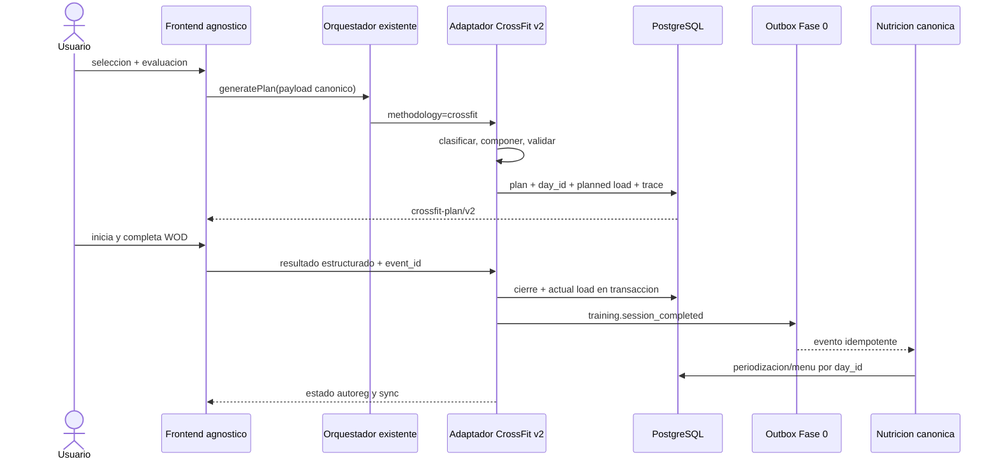

# Arquitectura, contratos e integracion

Objetivo: incorporar `crossfit-plan/v2` mediante adaptadores de metodologia, sin tocar el frontend agnostico, el redireccionador ni `WorkoutContext.generatePlan()`.

## Componentes futuros

| Componente                    | Responsabilidad                   | Prohibicion                  |
| ----------------------------- | --------------------------------- | ---------------------------- |
| CrossFitClassificationService | evaluar dimensiones y permisos    | no usar IA como juez final   |
| CrossFitCatalogRepository     | snapshot canonico versionado      | no leer filas Elite core     |
| CrossFitProgramBuilder        | bloque/semana/cuotas              | no persistir directamente    |
| CrossFitWodComposer           | formato, dosis, stimulus y escala | no relajar hard filters      |
| CrossFitPlanValidator         | invariantes por capas             | no autocorregir sin trace    |
| CrossFitAutoregReducer        | estado por eventos                | no mutar historia            |
| CrossFitTrainingLoadAdapter   | planned/actual `training-load/v1` | no activar antes de Fase 0   |
| CrossFitNutritionMapper       | D0/D1/D2 a motor canonico         | no calcular menu paralelo    |
| CrossFitDecisionTrace         | reglas y reasons sin PII          | no guardar prompts sensibles |

## Contratos API propuestos

| Operacion           | Request esencial                                              | Response                                      | Idempotencia                           |
| ------------------- | ------------------------------------------------------------- | --------------------------------------------- | -------------------------------------- |
| evaluar             | user auth + test results + screening version                  | classification, confidence, skill permissions | `user+assessment_version+submitted_at` |
| generar plan        | start, frequency, time, equipment snapshot, classification id | `crossfit-plan/v2`                            | plan idempotency key                   |
| single-day          | date/day_id, time, equipment, readiness                       | session v2                                    | user+date+purpose+revision             |
| regenerar           | plan/day, reason, expected revision                           | new revision + diff                           | request key                            |
| sustituir           | session, movement, symptom/equipment reason                   | validated scale/substitution                  | session+movement+revision              |
| iniciar             | plan_id+day_id+session revision                               | start event                                   | unique active start                    |
| pausar/reanudar     | session instance + monotonic sequence                         | timer state                                   | sequence/event id                      |
| finalizar/abandonar | structured result + feedback                                  | actual load + autoreg pending/applied         | completion event id                    |
| estado              | plan/day                                                      | session, sync, nutrition, autoreg status      | read only                              |

Todos responden `schema_version`, `ruleset_version`, `catalog_version`, `request_id` y errores con `reason_code`, `retryable`, `safe_fallback`.

## Persistencia

- Plan/sesion: tablas de metodologia existentes con JSON v2 o nuevas tablas normalizadas segun diseño de rama.
- Identidad: `plan_id + day_id`; date es atributo, no clave primaria de enlace.
- Resultado: entidad append-only con version y event id.
- Autoreg: reducer por eventos y snapshot derivado.
- Training load: metadata canonica de Fase 0 y outbox.
- Nutricion: solo override/periodizacion del motor existente, enlazado por `day_id`.
- Catalogo: version inmutable; historia conserva IDs/version.

## Secuencia de plan y cierre

## Cambio de metodologia

No convierte un plan activo en sitio. Se cierra/cancela con estado explicito, conserva historia y genera otro plan por el redireccionador. Las cargas ya completadas siguen alimentando recuperacion/nutricion; futuras sesiones canceladas no. No se reasigna nivel CrossFit desde `nivel_entrenamiento` general sin evaluacion.

## Errores y retry

- `4xx` contrato/seguridad: no reintentar automaticamente.
- `409` revision/idempotencia: recuperar estado canonico y mostrar diff.
- `5xx/network`: encolar solo evento con event id; nunca duplicar cierre.
- carga nutricional pendiente: entrenamiento queda cerrado, UI marca `sync_pending`.
- catalogo/ruleset no disponible: usar snapshot del plan, no la ultima version.
- offline durante WOD: timer y resultado local con monotonic events; sincronizar al volver. Esta capacidad debe probarse, no asumirse por existir cola general.

## Seguridad y privacidad

Autorizacion backend por `user_id`; RLS como segunda barrera; service role solo backend. Campos clinicos minimizados y sin prompts/logs. Decision traces excluyen texto medico; guardan rule IDs. Exportacion/borrado conserva las obligaciones de historia y privacidad acordadas. `REQUIERE_MIGRACION_AUTORIZADA`.

## Observabilidad

Metricas sin PII: generaciones/latencia, fallback por stage, invariant failures, bloqueos por family reason, completion/cap/abandon, outbox lag/retry/dead-letter, carga valid/degraded, nutrition sync, drift de distribucion de movimientos y catalog media coverage. Alertas: cualquier hard invariant persistido, duplicado de cierre, CrossFit load degradado >1 % tras rollout o acceso cruzado.

## Fase 0 compartida

`FASE_0_COMPARTIDA_DESBLOQUEADA_PARA_DESARROLLO`: planned/actual load, `day_id`, cierre/outbox, consumidor nutricional y métricas existen en el baseline. CrossFit se integra solo por extensión de registro/adaptador; no se reescribe convergencia. Los flags de emisión y nutrición siguen `false` hasta sus contract/integration/E2E y shadow metrics.
