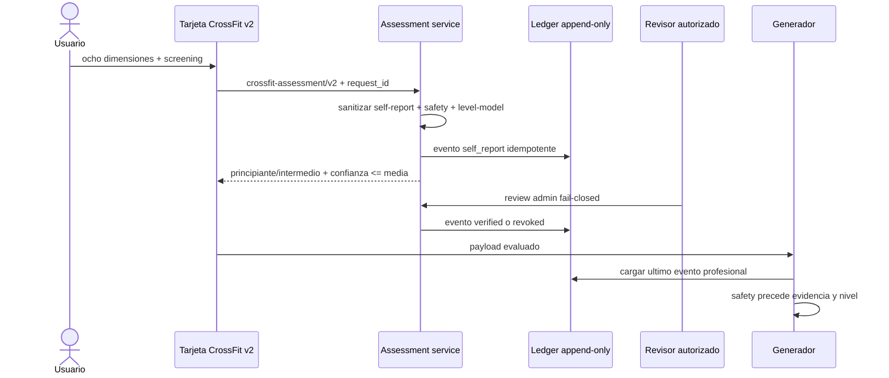
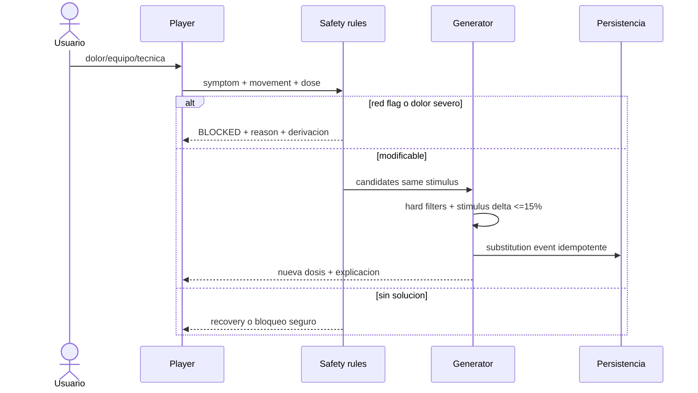

# Matriz completa de flujos Mindfit

Leyenda: `OK`, `IMPLEMENTADO_GATE_E2E`, `PARCIAL`, `DESCONECTADO`, `FALTA`,
`RIESGO`. `IMPLEMENTADO_GATE_E2E` significa contrato, persistencia y pruebas
unit/contract verdes en rama, pero no recorrido Playwright ni BD real.

| Flujo                | Actual                | Objetivo/contrato                                           | Persistencia                           | Error/QA clave                       |
| -------------------- | --------------------- | ----------------------------------------------------------- | -------------------------------------- | ------------------------------------ |
| Registro/login       | OK                    | auth existente; no pedir CrossFit aun                       | users/session                          | 401, duplicado, token expirado       |
| Onboarding           | PARCIAL               | reutilizar objetivo/frecuencia/lesiones; screening separado | users + profile                        | no duplicar valores; consentimiento  |
| Perfil/edicion       | PARCIAL               | canonico + safety screening versionado                      | users/user_profiles + nuevas entidades | conflicto de version, campos stale   |
| Seleccion metodo     | OK                    | conservar selector/redireccion                              | preferencia                            | alias interno/nombre neutral         |
| Cambio metodo        | PARCIAL               | cancelar futuro, conservar historia/carga                   | plan status/events                     | plan activo y nutrition sync         |
| Evaluacion           | IMPLEMENTADO_GATE_E2E | ocho dimensiones + safety + confianza                       | assessment ledger append-only          | RLS/UI/coach en CI y validacion      |
| Single-day           | IMPLEMENTADO_GATE_E2E | session v2 determinista                                     | plan/day/session/tracking              | no solution/red flag/reintento       |
| Plan completo        | IMPLEMENTADO_GATE_E2E | block/week/session v2                                       | methodology plans/days                 | cuotas/contrato/materialización      |
| Generacion           | IMPLEMENTADO_GATE_E2E | idempotency + trace                                         | draft + snapshot canónico              | same key/different output            |
| Regeneracion         | IMPLEMENTADO_GATE_E2E | revision/supersedes/reason/hash                             | immutable revisions                    | BD/colisión/revisión stale           |
| Calendario/Hoy       | IMPLEMENTADO_GATE_E2E | plan_id+day_id + sync states                                | plan days + workout schedule           | timezone/date fallback legacy        |
| Warm-up              | IMPLEMENTADO_GATE_E2E | especifico a patrones y flags                               | session blocks                         | QA visual/cobertura principal        |
| WOD player           | IMPLEMENTADO_GATE_E2E | score_type/dose/scale/stop rules v2                         | tracking + result events               | E2E real pendiente                   |
| Pausa/reanuda        | IMPLEMENTADO_GATE_E2E | monotonic event sequence + local durable queue              | runtime event ledger                   | multi-device fuera de alcance        |
| Sustitucion          | IMPLEMENTADO_GATE_E2E | same-stimulus validated edge                                | server-created substitution event      | BD/RLS/E2E pendientes                |
| Finalizacion         | IMPLEMENTADO_GATE_E2E | feedback confirma atomic close + actual load + outbox       | session/result/outbox                  | idempotent duplicate/BD              |
| Abandono             | IMPLEMENTADO_GATE_E2E | partial/abandoned/cancelled + motivo + completion           | session/result                         | PostgreSQL/Playwright real           |
| Resultado            | IMPLEMENTADO_GATE_E2E | structured score, scale, technique, pain                    | append-only result                     | invalid score/cap/RLS                |
| Feedback             | IMPLEMENTADO_GATE_E2E | mínimo obligatorio + draft owner/session durable            | local draft + result/readiness         | E2E real pendiente                   |
| Autorregulacion      | IMPLEMENTADO_GATE_E2E | event reducer v2                                            | events + snapshot                      | migración/RLS                        |
| Progresion/reeval    | PARCIAL               | block gates/classification                                  | assessments + plan snapshots           | captura objetiva al cierre pendiente |
| Historial/metricas   | PARCIAL               | version-aware comparable results                            | results/metrics                        | legacy low confidence                |
| Nutricion/menu       | IMPLEMENTADO_GATE_E2E | load mapper + canonical engine                              | context/menu by plan_id+day_id         | shadow/active/constraint DB          |
| Recetas/sustitucion  | OK general            | reuse preferences/macros                                    | nutrition tables                       | allergy hard filter                  |
| Lista compra         | IMPLEMENTADO_GATE_E2E | derivar cantidades de ítems reales                          | proyección de meal_items, sin tabla    | determinismo/estado pesado/E2E       |
| Hidratacion          | IMPLEMENTADO_GATE_E2E | rangos educativos solo active autoritativo                  | periodization_context                  | shadow invisible/no sodio universal  |
| Notificaciones       | DESCONECTADO          | reason-aware reminders only                                 | notification event                     | no medical claim/fatigue spam        |
| Logros               | RIESGO                | no reward pain/Rx/intensity; reward consistency/skill       | achievement event                      | gamification safety review           |
| Movil/escritorio     | PARCIAL               | same contract, responsive WOD controls                      | n/a                                    | 375x812 and desktop matrix           |
| Offline/retry        | IMPLEMENTADO_GATE_E2E | event IDs, cola runtime y feedback durable                  | local queue/draft/outbox               | airplane/CI real pendiente           |
| RLS/privacidad       | RIESGO                | owner policies + service role + audit                       | policies/logs                          | cross-user tests                     |
| Observabilidad/admin | PARCIAL               | metricas sin PII + revision fail-closed                     | metrics/assessment audit               | alertas/operacion humana             |

## Secuencia de evaluacion y confianza

## Secuencia de seguridad y sustitucion

## Contrato de cierre front-back-BD

Frontend envía una clave idempotente estable y estado `completed`, `capped`,
`partial`, `abandoned` o `cancelled`, completion, motivo, score tipado, RPE,
técnica, dolor y readiness. Las escalas se reconstruyen desde el ledger runtime,
no desde el payload cliente. Backend valida autoría y contrato, bloquea la sesión,
actualiza tracking/sesión, calcula actual load y persiste resultado, autorregulación
y outbox dentro de la transacción de esfuerzo. DB impone un resultado por sesión;
el worker nutricional no reabre el cierre.

## QA transversal

Cada fila requiere success, empty, unauthorized, invalid, network retry y stale revision donde aplique. Movil y escritorio deben usar los mismos contratos. Regresion obligatoria comprueba Hipertrofia actual (renombrada desde HipertrofiaV2) y Calistenia sin modificar sus artefactos ni reintroducir Hipertrofia legacy.

| Escenario                     | Respuesta esperada                    | Persistencia/oraculo           |
| ----------------------------- | ------------------------------------- | ------------------------------ |
| sin plan activo               | estado vacio accionable               | cero plan creado por lectura   |
| dia sin sesion                | descanso o siguiente sesion explicita | no fallback por fecha ambiguo  |
| catalogo sin candidato        | recovery/block con reason             | cero relajacion de hard filter |
| revision stale                | 409 + snapshot canonico               | cero overwrite                 |
| doble tap finalizar           | misma respuesta idempotente           | un result y un outbox          |
| red durante cierre            | sync pending + retry por event id     | no reabrir sesion              |
| evento offline fuera de orden | ordenar/reducir o dead-letter         | snapshot determinista          |
| nutrition worker caido        | entrenamiento cerrado                 | menu base y retry visible      |
| acceso usuario cruzado        | 403/404 no enumerable                 | cero filas leidas/escritas     |
| ruleset/catalogo actualizado  | usar snapshot del plan                | historia inmutable             |
| media ausente                 | instrucciones textuales               | nunca URL falsa                |
| timer en background           | monotonic elapsed                     | no tiempo negativo/duplicado   |
