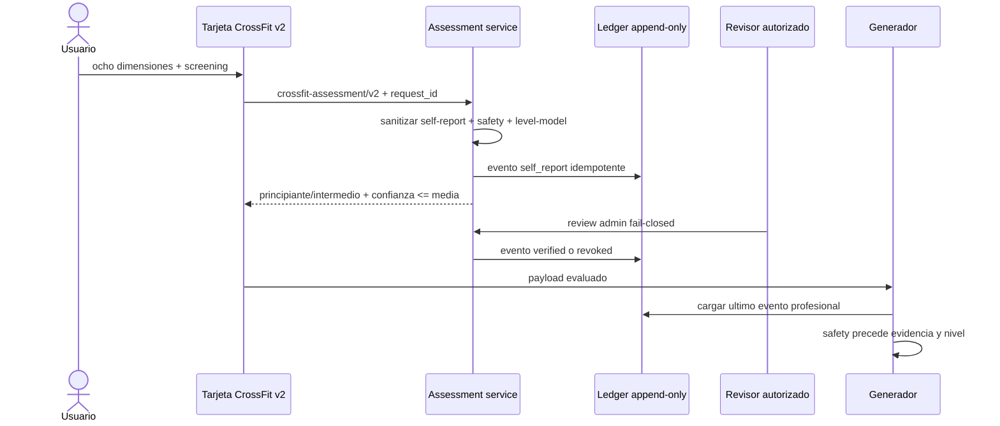
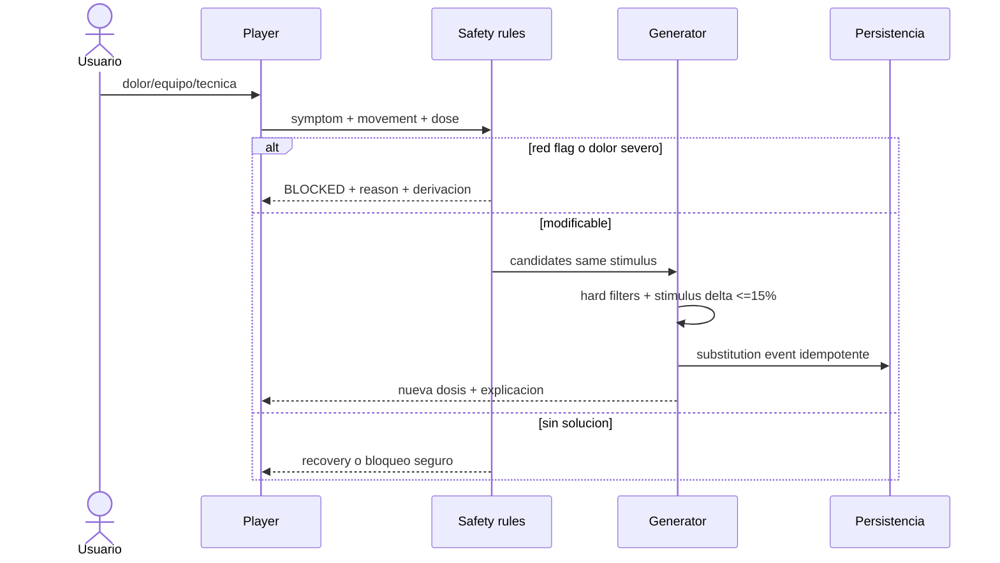

# Matriz completa de flujos Mindfit

Leyenda vigente: `OK_GENERAL`, `OK_QA_AISLADA`, `PARCIAL`, `DESCONECTADO`,
`FALTA` y `RIESGO_PREPRODUCCION`. `OK_GENERAL` corresponde a un flujo compartido
ya existente; `OK_QA_AISLADA` significa contrato, persistencia y recorrido
CrossFit aplicable verificados contra PostgreSQL efímero/Playwright. Ninguno
implica que las migraciones o flags estén activos en producción.

| Flujo                | Actual        | Objetivo/contrato                                           | Persistencia                           | Error/QA clave                          |
| -------------------- | ------------- | ----------------------------------------------------------- | -------------------------------------- | --------------------------------------- |
| Registro/login       | OK_GENERAL    | auth existente; no pedir CrossFit aun                       | users/session                          | 401, duplicado, token expirado          |
| Onboarding           | PARCIAL       | reutilizar objetivo/frecuencia/lesiones; screening separado | users + profile                        | no duplicar valores; consentimiento     |
| Perfil/edicion       | PARCIAL       | canonico + safety screening versionado                      | users/user_profiles + nuevas entidades | conflicto de version, campos stale      |
| Seleccion metodo     | OK_GENERAL    | conservar selector/redireccion                              | preferencia                            | alias interno/nombre neutral            |
| Cambio metodo        | PARCIAL       | cancelar futuro, conservar historia/carga                   | plan status/events                     | plan activo y nutrition sync            |
| Evaluacion           | OK_QA_AISLADA | ocho dimensiones + safety + confianza                       | assessment ledger append-only          | RLS/UI verdes; coach preproducción      |
| Single-day           | OK_QA_AISLADA | session v2 determinista                                     | plan/day/session/tracking              | replay, colisión y red flag verdes      |
| Plan completo        | OK_QA_AISLADA | block/week/session v2                                       | methodology plans/days                 | tres niveles E2E                        |
| Generacion           | OK_QA_AISLADA | idempotency + trace                                         | draft + snapshot canónico              | replay/colisión verdes                  |
| Regeneracion         | OK_QA_AISLADA | revision/supersedes/reason/hash                             | immutable revisions                    | BD, unicidad y stale verdes             |
| Calendario/Hoy       | OK_QA_AISLADA | plan_id+day_id + sync states                                | plan days + workout schedule           | fallback legacy se conserva             |
| Warm-up              | OK_QA_AISLADA | especifico a patrones y flags                               | session blocks                         | recorrido UI desktop/móvil              |
| WOD player           | OK_QA_AISLADA | score_type/dose/scale/stop rules v2                         | tracking + result events               | UI, timer, a11y y reload verdes         |
| Pausa/reanuda        | OK_QA_AISLADA | monotonic event sequence + local durable queue              | runtime event ledger                   | multi-device fuera de alcance           |
| Sustitucion          | OK_QA_AISLADA | same-stimulus validated edge o bloqueo                      | server-created substitution event      | éxito/replay y rechazo fail-closed      |
| Finalizacion         | OK_QA_AISLADA | feedback confirma atomic close + actual load + outbox       | session/result/outbox                  | replay y duplicado verdes               |
| Abandono             | OK_QA_AISLADA | partial/abandoned/cancelled + motivo + completion           | session/result                         | parcial/replay/colisión verdes          |
| Resultado            | OK_QA_AISLADA | structured score, scale, technique, pain                    | append-only result                     | RLS e inmutabilidad verdes              |
| Feedback             | OK_QA_AISLADA | mínimo obligatorio + draft owner/session durable            | local draft + result/readiness         | reload UI verde                         |
| Autorregulacion      | OK_QA_AISLADA | event reducer v2                                            | events + snapshot                      | siete estados y RLS verdes              |
| Progresion/reeval    | PARCIAL       | block gates/classification                                  | assessments + plan snapshots           | captura objetiva al cierre pendiente    |
| Historial/metricas   | PARCIAL       | version-aware comparable results                            | results/metrics                        | legacy low confidence                   |
| Nutricion/menu       | OK_QA_AISLADA | load mapper + canonical engine                              | context/menu by plan_id+day_id         | D0/D1/D2 shadow verde; active bloqueado |
| Recetas/sustitucion  | OK_GENERAL    | reuse preferences/macros                                    | nutrition tables                       | allergy hard filter                     |
| Lista compra         | OK_QA_AISLADA | derivar cantidades de ítems reales                          | proyección de meal_items, sin tabla    | unit/contrato verde                     |
| Hidratacion          | OK_QA_AISLADA | rangos educativos solo active autoritativo                  | periodization_context                  | shadow invisible/no sodio universal     |
| Notificaciones       | DESCONECTADO  | reason-aware reminders only                                 | notification event                     | no medical claim/fatigue spam           |
| Logros               | RIESGO        | no reward pain/Rx/intensity; reward consistency/skill       | achievement event                      | gamification safety review              |
| Movil/escritorio     | OK_QA_AISLADA | same contract, responsive WOD controls                      | n/a                                    | 16 E2E desktop/375x812                  |
| Offline/retry        | OK_QA_AISLADA | event IDs, cola runtime y feedback durable                  | local queue/draft/outbox               | caída de red/reintento verde            |
| RLS/privacidad       | OK_QA_AISLADA | owner policies + service role + audit                       | policies/logs                          | cross-user y append-only verdes         |
| Observabilidad/admin | OK_QA_AISLADA | metricas sin PII + revision fail-closed                     | metrics/assessment audit               | métricas QA verdes; operación pendiente |

## Secuencia de evaluacion y confianza

## Secuencia de seguridad y sustitucion

## Contrato de cierre front-back-BD

Frontend envía una clave idempotente estable y estado `completed`, `capped`,
`partial`, `abandoned` o `cancelled`, completion, motivo, score tipado, RPE,
técnica, dolor y readiness. Las escalas se reconstruyen desde el ledger runtime,
no desde el payload cliente. Backend valida autoría y contrato, bloquea la sesión,
actualiza tracking/sesión, calcula actual load y persiste resultado, autorregulación
y outbox dentro de la transacción de esfuerzo. DB impone un resultado por sesión;
el worker nutricional no reabre el cierre.

## QA transversal

Cada fila requiere success, empty, unauthorized, invalid, network retry y stale
revision donde aplique. Las filas `OK_QA_AISLADA` están demostradas por unit,
integración o los 16 E2E según su naturaleza; no todos los estados negativos
pertenecen al mismo recorrido UI. Las filas `PARCIAL` o `DESCONECTADO` no se
ocultan: onboarding clínico estructurado, cambio de metodología,
notificaciones/logros y captura objetiva de progresión requieren carriles
posteriores. Regresión obligatoria comprueba Hipertrofia actual y Calistenia sin
modificar sus motores ni reintroducir Hipertrofia legacy.

El run `30050111128` fijó navegador y resolución de inicio en `Europe/Madrid`,
incluyó medianoche/DST y confirmó `16/16` sin skips. El gate de seguridad externo
de GitGuardian permanece rojo y bloquea el merge aunque estos flujos estén verdes.

| Escenario                     | Respuesta esperada                    | Persistencia/oraculo           |
| ----------------------------- | ------------------------------------- | ------------------------------ |
| sin plan activo               | estado vacio accionable               | cero plan creado por lectura   |
| dia sin sesion                | descanso o siguiente sesion explicita | no fallback por fecha ambiguo  |
| catalogo sin candidato        | recovery/block con reason             | cero relajacion de hard filter |
| revision stale                | 409 + snapshot canonico               | cero overwrite                 |
| doble tap finalizar           | misma respuesta idempotente           | un result y un outbox          |
| red durante cierre            | sync pending + retry por event id     | no reabrir sesion              |
| evento offline fuera de orden | ordenar/reducir o dead-letter         | snapshot determinista          |
| nutrition worker caido        | entrenamiento cerrado                 | menu base y retry visible      |
| acceso usuario cruzado        | 403/404 no enumerable                 | cero filas leidas/escritas     |
| ruleset/catalogo actualizado  | usar snapshot del plan                | historia inmutable             |
| media ausente                 | instrucciones textuales               | nunca URL falsa                |
| timer en background           | monotonic elapsed                     | no tiempo negativo/duplicado   |
