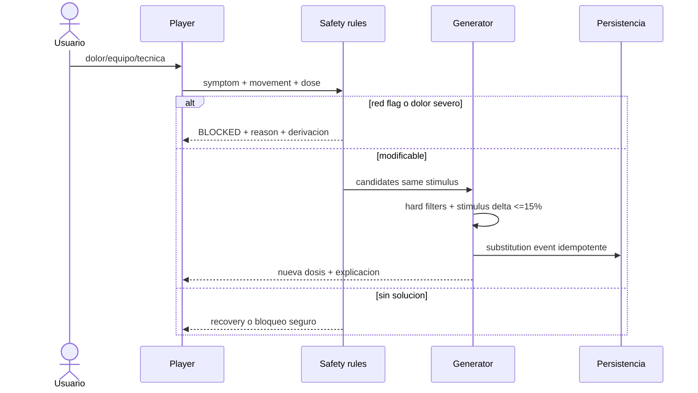

# Matriz completa de flujos Mindfit

Leyenda: `OK`, `IMPLEMENTADO_GATE_E2E`, `PARCIAL`, `DESCONECTADO`, `FALTA`,
`RIESGO`. `IMPLEMENTADO_GATE_E2E` significa contrato, persistencia y pruebas
unit/contract verdes en rama, pero no recorrido Playwright ni BD real.

| Flujo                | Actual                | Objetivo/contrato                                           | Persistencia                           | Error/QA clave                      |
| -------------------- | --------------------- | ----------------------------------------------------------- | -------------------------------------- | ----------------------------------- |
| Registro/login       | OK                    | auth existente; no pedir CrossFit aun                       | users/session                          | 401, duplicado, token expirado      |
| Onboarding           | PARCIAL               | reutilizar objetivo/frecuencia/lesiones; screening separado | users + profile                        | no duplicar valores; consentimiento |
| Perfil/edicion       | PARCIAL               | canonico + safety screening versionado                      | users/user_profiles + nuevas entidades | conflicto de version, campos stale  |
| Seleccion metodo     | OK                    | conservar selector/redireccion                              | preferencia                            | alias interno/nombre neutral        |
| Cambio metodo        | PARCIAL               | cancelar futuro, conservar historia/carga                   | plan status/events                     | plan activo y nutrition sync        |
| Evaluacion           | PARCIAL               | classification v2 objetiva                                  | snapshot en plan; entidad futura       | UI específica/alta confianza        |
| Single-day           | IMPLEMENTADO_GATE_E2E | session v2 determinista                                     | plan/day/session/tracking              | no solution/red flag/reintento      |
| Plan completo        | IMPLEMENTADO_GATE_E2E | block/week/session v2                                       | methodology plans/days                 | cuotas/contrato/materialización     |
| Generacion           | IMPLEMENTADO_GATE_E2E | idempotency + trace                                         | draft + snapshot canónico              | same key/different output           |
| Regeneracion         | FALTA                 | revision/supersedes/reason                                  | immutable revisions                    | no tocar completadas                |
| Calendario/Hoy       | IMPLEMENTADO_GATE_E2E | plan_id+day_id + sync states                                | plan days + workout schedule           | timezone/date fallback legacy       |
| Warm-up              | IMPLEMENTADO_GATE_E2E | especifico a patrones y flags                               | session blocks                         | QA visual/cobertura principal       |
| WOD player           | IMPLEMENTADO_GATE_E2E | score_type/dose/scale/stop rules v2                         | tracking + result events               | background/offline                  |
| Pausa/reanuda        | PARCIAL               | monotonic event sequence                                    | session instance                       | doble tap/reload/device             |
| Sustitucion          | PARCIAL               | same-stimulus validated edge                                | substitution event                     | pain priority/equipment             |
| Finalizacion         | IMPLEMENTADO_GATE_E2E | atomic close + actual load + outbox                         | result/outbox                          | idempotent duplicate/BD             |
| Abandono             | PARCIAL               | reason taxonomy + partial actual load                       | result                                 | pain vs agenda semantics            |
| Resultado            | IMPLEMENTADO_GATE_E2E | structured score, scale, technique, pain                    | append-only result                     | invalid score/cap/RLS               |
| Feedback             | IMPLEMENTADO_GATE_E2E | required minimum; optional details                          | result/readiness                       | privacidad/skip pendiente           |
| Autorregulacion      | IMPLEMENTADO_GATE_E2E | event reducer v2                                            | events + snapshot                      | migración/RLS                       |
| Progresion/reeval    | FALTA v2              | block gates/classification                                  | assessments                            | asymmetric skills                   |
| Historial/metricas   | PARCIAL               | version-aware comparable results                            | results/metrics                        | legacy low confidence               |
| Nutricion/menu       | PARCIAL               | load mapper + canonical engine                              | override/menu by day_id                | sync pending/degraded               |
| Recetas/sustitucion  | OK general            | reuse preferences/macros                                    | nutrition tables                       | allergy hard filter                 |
| Lista compra         | OK general            | recalc only unconsumed days                                 | shopping list                          | idempotent diff                     |
| Hidratacion          | PARCIAL               | sweat-rate education and flags                              | user observations                      | no universal sodium                 |
| Notificaciones       | DESCONECTADO          | reason-aware reminders only                                 | notification event                     | no medical claim/fatigue spam       |
| Logros               | RIESGO                | no reward pain/Rx/intensity; reward consistency/skill       | achievement event                      | gamification safety review          |
| Movil/escritorio     | PARCIAL               | same contract, responsive WOD controls                      | n/a                                    | 375x812 and desktop matrix          |
| Offline/retry        | PARCIAL               | event IDs and conflict recovery                             | local queue/outbox                     | airplane/reload/duplicate           |
| RLS/privacidad       | RIESGO                | owner policies + service role + audit                       | policies/logs                          | cross-user tests                    |
| Observabilidad/admin | PARCIAL               | no-PII metrics and catalog/ruleset view                     | metrics/audit                          | alert thresholds                    |

## Secuencia de seguridad y sustitucion

## Contrato de cierre front-back-BD

Frontend envia: event id, plan/day/session/revision, estado completed/abandoned/capped, score tipado, elapsed, escala por movimiento, carga/reps, RPE, tecnica, dolor y readiness minimo. Backend valida autoria/revision, calcula actual load, persiste resultado y outbox en transaccion y devuelve autoreg/sync. DB impone unicidad de event id y una finalizacion canonica. El worker procesa nutricion sin reabrir el cierre.

## QA transversal

Cada fila requiere success, empty, unauthorized, invalid, network retry y stale revision donde aplique. Movil y escritorio deben usar los mismos contratos. Regresion obligatoria comprueba Hipertrofia, HipertrofiaV2 y Calistenia sin modificar sus artefactos.

| Escenario                     | Respuesta esperada                    | Persistencia/oraculo           |
| ----------------------------- | ------------------------------------- | ------------------------------ |
| sin plan activo               | estado vacio accionable               | cero plan creado por lectura   |
| dia sin sesion                | descanso o siguiente sesion explicita | no fallback por fecha ambiguo  |
| catalogo sin candidato        | recovery/block con reason             | cero relajacion de hard filter |
| revision stale                | 409 + snapshot canonico               | cero overwrite                 |
| doble tap finalizar           | misma respuesta idempotente           | un result y un outbox          |
| red durante cierre            | sync pending + retry por event id     | no reabrir sesion              |
| evento offline fuera de orden | ordenar/reducir o dead-letter         | snapshot determinista          |
| nutrition worker caido        | entrenamiento cerrado                 | menu base y retry visible      |
| acceso usuario cruzado        | 403/404 no enumerable                 | cero filas leidas/escritas     |
| ruleset/catalogo actualizado  | usar snapshot del plan                | historia inmutable             |
| media ausente                 | instrucciones textuales               | nunca URL falsa                |
| timer en background           | monotonic elapsed                     | no tiempo negativo/duplicado   |
